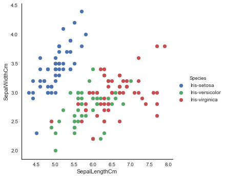
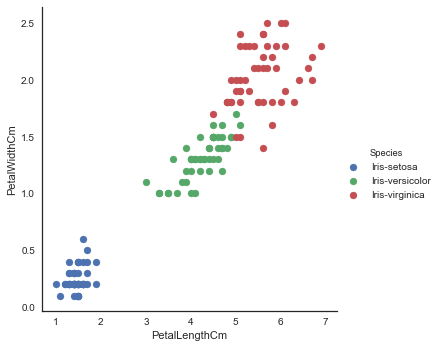
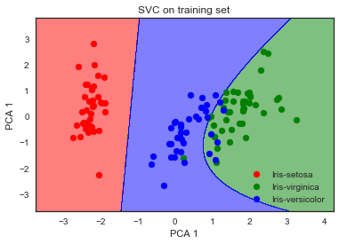
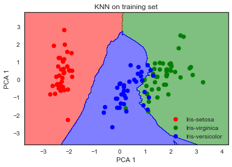
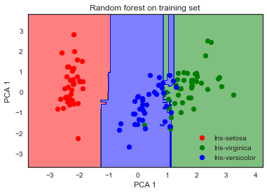
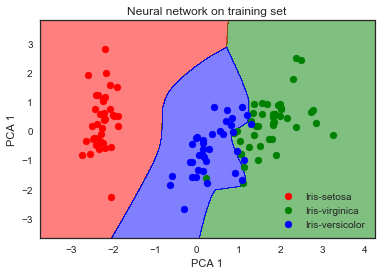

## Iris classification

The Iris flower data set or Fisher's Iris data set is a multivariate data set introduced by the British statistician and biologist Ronald Fisher in his 1936 paper The use of multiple measurements in taxonomic problems as an example of linear discriminant analysis.[1] It is sometimes called Anderson's Iris data set because Edgar Anderson collected the data to quantify the morphologic variation of Iris flowers of three related species.[2] Two of the three species were collected in th e Gaspé Peninsula "all from the same pasture, and picked on the same day and measured at the same time by the same person with the same apparatus".

The data set consists of 50 samples from each of three species of Iris (Iris setosa, Iris virginica and Iris versicolor). Four features were measured from each sample: the length and the width of the sepals and petals, in centimetres.

*from [Wikipedia](https://en.wikipedia.org/wiki/Iris_flower_data_set)*

*Sepal dimensions*

*Petal dimensions*

### SVM (C=100000000.0, criterion = 'gini', gamma=0.0001, kernel='rbf')

*SVM decision boundary on training set*

**Classification report on test set**

| **precision**   | **recall**     | **f1 score**   | **support**     |
| :-------------: | :------------: | :------------: | :-------------: |
| 1.00            | 1.00           | 1.00           | 11              |
| 1.00            | 1.00           | 1.00           | 6               |
| 1.00            | 1.00           | 1.00           | 3               |

**Confusion matrix on test set**

|          | **predicted**| **predicted**| **predicted**| 
|:--------:| :-----------:| :-----------:| :-----------:|
|**actual**| 11           | 0            | 0            |
|**actual**| 0            | 6            | 0            |
|**actual**| 0            | 0            | 13           |

**CV Accuracy scores** [ 1.  1.  1.  1.  1.  1.  1.  1.  1.  1.]

**Mean accuracy**  1.0

### KNN (n_neighbors=9, metric = 'minkowski')

*KNN decision boundary on training set*

**Classification report on test set**

| **precision**   | **recall**     | **f1 score**   | **support**     |
| :-------------: | :------------: | :------------: | :-------------: |
| 1.00            | 1.00           | 1.00           | 11              |
| 1.00            | 1.00           | 1.00           | 6               |
| 1.00            | 1.00           | 1.00           | 3               |

**Confusion matrix on test set**

|          | **predicted**| **predicted**| **predicted**| 
|:--------:| :-----------:| :-----------:| :-----------:|
|**actual**| 11           | 0            | 0            |
|**actual**| 0            | 6            | 0            |
|**actual**| 0            | 0            | 13           |

**CV Accuracy scores** [ 0.8         0.75        0.75        0.66666667  0.66666667 0.66666667 1.          1.          1.          1.        ]

**Mean accuracy**  0.83

### Random forest(criterion='gini', max_depth=10, n_estimators = 10)

*Random forest decision boundary on training set*

**Classification report on test set**

| **precision**   | **recall**     | **f1 score**   | **support**     |
| :-------------: | :------------: | :------------: | :-------------: |
| 1.00            | 1.00           | 1.00           | 11              |
| 1.00            | 1.00           | 1.00           | 6               |
| 1.00            | 1.00           | 1.00           | 3               |

**Confusion matrix on test set**

|          | **predicted**| **predicted**| **predicted**| 
|:--------:| :-----------:| :-----------:| :-----------:|
|**actual**| 11           | 0            | 0            |
|**actual**| 0            | 6            | 0            |
|**actual**| 0            | 0            | 13           |

**CV Accuracy scores** [ 1.          0.75        1.          0.66666667  1.          1.          1.   1.        1.          1.        ]

**Mean accuracy**  0.941666666667

### Neural network MLPClassifier(activation='relu', learning_rate='adaptive', learning_rate_init=0.001, alpha=1e-05)

**Classification report on test set**

| **precision**   | **recall**     | **f1 score**   | **support**     |
| :-------------: | :------------: | :------------: | :-------------: |
| 1.00            | 1.00           | 1.00           | 11              |
| 1.00            | 1.00           | 1.00           | 6               |
| 1.00            | 1.00           | 1.00           | 3               |

**Confusion matrix on test set**

|          | **predicted**| **predicted**| **predicted**| 
|:--------:| :-----------:| :-----------:| :-----------:|
|**actual**| 11           | 0            | 0            |
|**actual**| 0            | 6            | 0            |
|**actual**| 0            | 0            | 13           |

**CV Accuracy scores** [ 1.          1.          1.          0.66666667  1.          1.          1. 1.          1.          1.        ]

**Mean accuracy**  0.966666666667